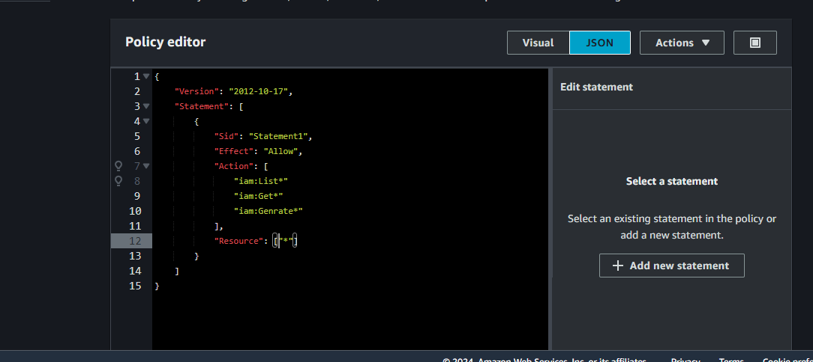

# AWS IAM User and Group Management Guide
AWS Identity and Access Management (IAM) enables you to manage access to AWS services and resources securely. This guide provides step-by-step instructions to create IAM users, groups, and attach policies to control permissions.

### Creating an IAM USER
- Sign into aws management console
- Use the search engine type "IAM"
- Navigte to the pane and choose create user.
### Create an IAM User
- Click on "IAM USER"
- Navigate to the "Create user"button
- Assign a name to the user
- Tick provide user access to aws management console 
- Choose "i want to create an IAM User
- choose custom Password
- Click on the "Next" button
- ### Adding Users to Groups
  ### Set Permission 
 - On the "Set Permissions" page, choose Add   user to group.
- Select the Group: Check the box next to the group you created (e.g., Developers).
- Click on "Next: Tags" (optional) to add metadata to the user.
- Click on "Next: Review", then Create User.
  
  ## Creating Group User
  ### Creating IAM User Groups:
  - Select on Group user on the IAM Console Dashboard
  -  Click on the "create Groups"
  -  Assign a user group name (eg Developers)
  -  Click on the "create user"button
  

  ### Creating  IAM Roles
  - Click on the "Create Role"button
  - Select aws service
  - Click on the use case dropdown button and select EC2
  - Click on Next button
  - Assign a Name to the role 
  - Description:AllowAccesstoEC2
  #### Add Permission 
  - Leave it on default
  - Click on "create role"

### IAM USER POLICY
 - Click on create Policy
  ### Specify  Permission 
  -Click on JSON

- Choose all for resources using "*"
### Review Policy
- Click on Next: Tags (optional) to add metadata to the policy.
- Click on Next: Review.
- Click on Next
### Name and Description
- Enter a name "IAM_VIEW_ONLY".
- Enter a description for the policy, such as "This policy grants read-only access to IAM resources".
### Create Policy
Click on Create policy.

