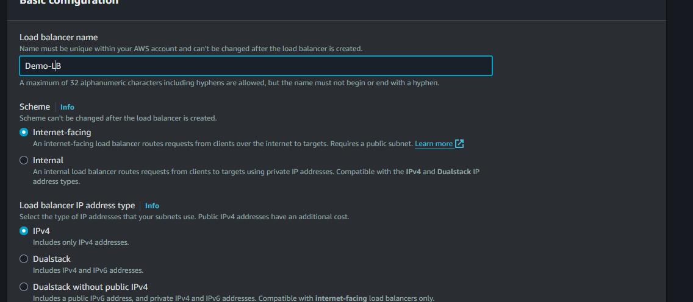

# Deploying ALB(Application load balancer) with 2 instances
## Task 1: Create Two EC2 Instances
### Step 1:
- Log into the AWS Management Console
Open your web browser and go to the AWS Management Console at https://console.aws.amazon.com/.
Enter your AWS account credentials (username and password) and click "Sign In".

### Step 2: Navigate to the EC2 service
- Once logged in, click on "Services" in the top left corner of the console.
In the search bar, type "EC2" and click on "EC2" from the options that appear.
### Step 4: Launch two EC2 instances in the same subnet
- Click on "Instances" in the EC2 dashboard.

- Click on the "Launch Instance" button.

- Choose an Amazon Machine Image (AMI), instance type, and configure other instance details as required.

### In the "Configure Instance Details" step:

- Choose the same subnet for both instances to ensure they are in the same network.

- Configure the security group that allows SSH port 22 and HTTP port 80 traffic

- Paste the UserData script into the "Advanced Details" section under "User data".

Copy the following UserData script:
```
#!/bin/bash
yum update -y
sudo yum install -y httpd 
sudo systemctl enable httpd 
sudo systemctl start httpd
```
- Complete the instance launch process by configuring storage, adding tags, configuring security groups, and reviewing the instance launch details.

- Click on "Launch Instances" to launch both EC2 instances.

##  Task 2: Set Up ALB
### Step 1: Create a new Application Load Balancer (ALB)
- In the EC2 dashboard, locate the left navigation pane.
- Click on "Load Balancers" under the "Load Balancing" section.
- Click on the "Create Load Balancer" button at the top of the page.
- Select "Application Load Balancer" from the options provided.

### Step 4: Configure ALB settings
### Step 1: Define Load Balancer

- Enter a name for your ALB.
  
- Select the appropriate scheme (usually internet-facing).
- Choose the same VPC where your EC2 instances reside.
### Step 2: Assign Security Settings

- Choose an existing security group or create a new one.
- Ensure that the security group allows traffic on the required ports (e.g., 80 for HTTP).
### Step 3: Configure Routing

- Define a listener configuration by specifying the port and protocol (e.g., HTTP/80).
- Choose an existing target group or create a new one.
### Task 5: Create a Target Group for the Listener
### Step 1: Navigate to the Target Groups Section
- In the AWS Management Console, navigate to the EC2 service.
- In the left navigation pane, click on "Target Groups" under the "Load Balancing" section.
### Step 2: Create a New Target Group
- Click on the "Create target group" button at the top of the page.
### Step 3: Configure the Target Group Settings
### Basic Configuration:

- Choose a target type: Select "Instances" as the target type.
- Give your target group a name: Enter a name for your target group.
- Protocol: Select "HTTP" or "HTTPS" depending on your requirements.
- Enter the port number your application is listening on (e.g., 80 for HTTP, 443 for HTTPS).
- Health Checks:

- Protocol: Select the protocol for health checks (HTTP or HTTPS).
- Path: Specify the ping path for health checks (e.g., / or /health).
- Advanced health check settings (optional): Adjust settings like health check interval, timeout, and the number of healthy/unhealthy thresholds as needed.
### VPC and Subnet:

- Ensure the target group is associated with the same VPC as your EC2 instances.
### Step 4: Register Targets
### Add EC2 Instances:

- In the "Registered targets" section, select the EC2 instances you want to include in the target group.
- Check the instances from the list and click on the "Include as pending below" button.
### Port:

- Ensure the correct port is specified for each instance.
### Step 5: Review and Create
- Review all the settings and configurations to ensure they are correct.
- Click on the "Create target group" button to finalize the creation.
### Step 6: Attach the Target Group to the ALB Listener
- Navigate back to the EC2 dashboard and select "Load Balancers" from the left navigation pane.

- Select your previously created Application Load Balancer (ALB) from the list.

- In the "Listeners" tab, click on "View/edit rules" for the listener you want to attach the target group to.

- Click on the "+" icon to add a new rule.

- Define the routing rule (e.g., if the path is /, then forward to the target group).

- Click on "Add Action" and choose "Forward to" and select the newly created target group.

- Click on "Save" to apply the changes.

### Step 4: Configure Advanced Settings

- Choose your desired load balancer attributes, such as idle timeout and deletion protection.
- Configure routing behavior if necessary.
### Step 5: Add Tags (Optional)

- Optionally, add tags to your ALB for better organization and management.
### Step 6: Review and Create

- Review the configuration details to ensure everything is correct.
- Click on the "Create" button to create the ALB.
### Task 5: Test Load Balancing
- Step 1: Obtain the DNS name of the ALB
Select your Application Load Balancer (ALB) from the list.
In the details section at the bottom, find the "DNS name" of the ALB. It will look something like my-alb-1234567890.us-west-2.elb.amazonaws.com.
### Step 2: Open a Web Browser and Access the ALB DNS Name
- Open a web browser on your computer.
In the address bar, enter the DNS name of the ALB obtained in Step 1 and press Enter.
- You should see the web application served by one of your EC2 instances.
### Step 3: Verify Traffic Distribution
Refresh the web browser multiple times and observe the responses.
- If you have set up your EC2 instances with distinguishable content (e.g., different welcome messages or hostnames), you should see responses from both instances alternately.
- Alternatively, you can check the access logs on both EC2 instances to verify the receiving requests from the ALB.