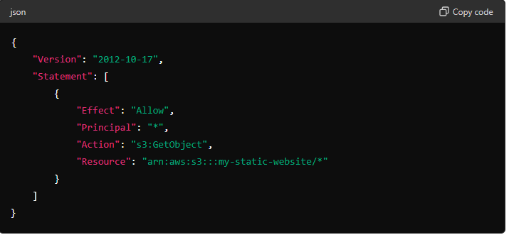

Amazon S3 (Simple Storage Service) is an object storage service that offers scalability, data availability, security, and performance. 
## Steps to Create an S3 Bucket
### 1. Open the S3 Console
- In the AWS Management Console, search for S3 in the services search bar and click on S3.
### 2 Create a New Bucket
- Click on the Create bucket button.
### Configure Bucket Settings
- Bucket Name: Enter a unique name for your bucket (e.g., my-unique-bucket-name). Bucket names must be globally unique.
- Region: Select the AWS Region where you want to create the bucket (e.g., US East (N. Virginia) us-east-1).
- Configure Options (Optional)
### Bucket settings for Block Public Access: 
- Choose the default settings to block public access or customize as per your requirements.
  
- Bucket Versioning: Enable if you want to keep multiple versions of an object in the same bucket.
- Tags: Add key-value pairs to help organize and manage your S3 resources.
- Object Lock: Enable if you want to store objects using a write-once-read-many.
#### Review and Create
-Review the settings you have configured.
- Click on the Create bucket button.
### Post-Creation Steps
Once the bucket is created, you can:

### Upload Files: 
- Click on the bucket name  
- Click Upload to add files to your bucket.
  
- Set Permissions: Configure permissions to control who can access the bucket and its objects.
- Enable Versioning: If not done during creation, you can enable versioning to keep multiple versions of objects.
- Configure Bucket Policies: Define policies to grant or deny permissions to users and services.
- Enable Logging: Enable server access logging to track requests for access to your bucket.

## Hosting a Static Website on Amazon S3
### Configure Bucket for Static Website Hosting
- Click on the name of the bucket you just created.

- Click on the Properties tab.

### Static Website Hosting:

- Click on Edit in the Static website hosting section.
#### Select Enable.
- Select Host a static website.
- Enter index.html.
- Optionally, enter error.html.
- Click on "Save changes".

### Upload Website Content
- Click on the Objects tab.
- Click on "Upload".
- Click on Add files and select the files (e.g., index.html, style.css, etc.) from your local machine.
- Click on Upload at the bottom.
#### Set Permissions
- Click on the Permissions tab.
- Scroll down to Bucket policy and click Edit.
- Policy JSON: Enter the following JSON to allow public read access to the bucket:

- Replace my-static-website with your bucket name.

- Save Changes: Click on Save changes.
### Configure Index Document
- Go back to the Properties tab.
- Static Website Hosting: Ensure that the Index document is set to index.html.
- Access the Website
- In the Properties tab, in the Static website hosting section, you will see the Bucket website endpoint.
- Click on the URL or copy and paste it into your browser to view your static website

