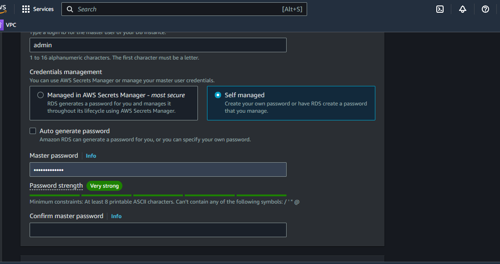

# 1. Create a VPC
## Guide to Creating a Virtual Private Cloud (VPC) for WordPress Infrastructure
### Step 1: Define Address Range for the VPC
- Determine the CIDR block for the VPC.
- Example: 10.0.0.0/16
### Step 2: Create VPC with Public and Private Subnets
- Create the VPC:

- Navigate to the VPC Dashboard in your AWS Management Console.
- Click on "Create VPC".
- Enter the VPC name (e.g.,Demo-VPC).
- Set the IPv4 CIDR block to 10.0.0.0/16.
- Select "Default" for Tenancy.
- Click on "Create VPC". 
### Create Subnets:

- Go to the Subnets section in the VPC Dashboard.
- Click on "Create Subnet".
### create a public subnet

- Give your subnet a name "Public-subnet"
- Assign an existing VPC to the subnet "Demo-VPC"
  
- Choose an Availability Zone: Choose one (e.g., us-west-2a)
- Allocate an IPv4 CIDR block: 10.0.1.0/24(which should be within the CIDR range)
- Click on "Create subnet".
### Create a private Subnet
- Give the second subnet a name Private Subnet.
- Attache an existing VPC to the subnet
  " WordPress-VPC"
- Choose an Availability Zone: Choose one (e.g., us-west-2a)
- Allocate an IPv4 CIDR block: 10.0.2.0/24
- Click on "Create subnet".
## Step 3: Configure Route Tables for Each Subnet
### Create Route Table for Public Subnet:

- Go to the Route Tables section in the VPC Dashboard.
- Click on "Create Route Table".
Give the route-table a name "Public-Route-Table"
Assign an existing vpc to the route-table "DemoVPC"

- Click on "Create route table".
### Create Internet Gateway:

- Go to the Internet Gateways section.
-Click on "Create Internet Gateway".
- Give the internet gateway a name "Demo-IGW"
- Click on "Create internet gateway".
- Select the newly created Internet Gateway and - click "Attach to VPC".

- Choose WordPress-VPC and click "Attach".
### Update Route Table:

- Go back to the Route Tables section.
- Select Public-Route-Table.
- Go to the Routes tab and click on "Edit routes".
  
- Click on "Add route".
- Destination: 0.0.0.0/0
- Target: Select Internet Gateway and choose Demo-IGW.
- Click "Save routes".
### Associate Public Subnet:

- Go to the Subnet Associations tab.
- Click on "Edit subnet associations".

- Select Public-Subnet.
- Click "Save associations".
### Create Route Table for Private Subnet:

- Go to the Route Tables section in the VPC Dashboard.
- Click on "Create Route Table".
- Give the route-table a name: Private-Route-Table
- Attach an existing VPC "WordPress-VPC"
- Click on "Create route table".
- Update Route Table:

This route table will not have a route to the Internet Gateway, so it uses the default local route.
### Associate Private Subnet:

- Go to the Subnet Associations tab.
- Click on "Edit subnet associations".
- Select Private-Subnet.
- Click "Save associations".
### Step 4: Configure a NAT Gateway for Private Subnet Internet Access
### Create the NAT Gateway:

- Go to the NAT Gateways section.
- Click on "Create NAT Gateway".
- Attach the existing  Public-Subnet.
- Elastic IP Allocation ID: Select the Elastic IP you just created.
  
- Click on "Create NAT Gateway".
### Update the Route Table for the Private Subnet:

- Go to the Route Tables section.
- Select Private-Route-Table.
- Go to the Routes tab and click on "Edit routes".
- Click on "Add route".
- Destination: 0.0.0.0/0
- Target: Select NAT Gateway and choose the newly created NAT Gateway.
- Click "Save routes"
Step-by-Step Guide to Deploy a Managed MySQL Database Using Amazon RDS for WordPress Data Storage
create an instance
Step 1: Navigate to the EC2 Dashboard
Access EC2 Dashboard:

In the AWS Management Console, search for EC2 in the services search bar.
Click on EC2 to open the EC2 Dashboard.
# Step 2: Launch an Instance
- On the EC2 Dashboard, click the Launch instance button.
Choose an Amazon Machine Image (AMI):

- Select an AMI from the list. You can choose from Amazon Linux, Ubuntu, Windows, or other pre-configured images.
- Click Select next to the desired AMI.
- Choose an Instance Type:

- Select the instance type that suits your needs (e.g., t2.micro for free tier eligible).
- Click Next: Configure Instance Details.
  ### Select a Key Pair:

- Select an existing key pair or create a new key pair.
If creating a new key pair, download the key pair file (.pem) and keep it secure. You will need it to access your instance.
- Check the acknowledgment box.
- Click Launch Instances.
### Configure Instance Details:

Configure the instance details as needed. For a basic setup, you can leave the default settings.
### Key configurations include:
- Number of instances: Typically 1.
Network: Select your VPC.
- Subnet: Choose a subnet within your VPC.
- Auto-assign Public IP: Enable if you need direct internet access.
- Click Next: Add Storage.
### Add Storage:

Configure the storage for your instance. The default storage settings should be sufficient for basic use.
### Configure Security Group:

- Create a new security group or select an existing one.
- Add rules to allow necessary traffic (e.g., SSH for Linux or RDP for Windows).
### Example for SSH access:
- Type: SSH

- Protocol: TCP

- Port Range: 22

- Source: 0.0.0.0/0

- Type: HTTPS

- Protocol: TCP

- Port Range: 443

- Source: `0.0.0.0/0
  

- Type: MYSQL/Aurora

- Protocol: TCP

- Port Range: 3306

- Source: webserver security group

- Type: NFS

- Protocol: TCP

- Port Range: 2049

- Source: `0.0.0.0/0

### Review and Launch:

- Review your instance configuration.
- Click Launch.
#### View Instances:

Click View Instances to see your newly launched instance.
Wait for the instance state to change to running.
### Step 3: Connect to Your Instance
- Get the Public DNS Name or IP Address:

- In the EC2 Dashboard, select your instance.
- Copy the Public DNS name or IP address.
- Connect via SSH (for Linux) or RDP (for Windows):

### For Linux:
- Open a terminal.
- Run the following command to connect (replace your-key-pair.pem and your-public-dns with your details):
ssh -i /path/to/your-key-pair.pem ec2-user@your-public-dns
### For Windows:
- Use Remote Desktop Connection.
- Enter the Public DNS or IP address of your instance.
- Log in with the username Administrator and the password retrieved from the EC2 console.
- This setup ensures that your EC2 instance is launched and accessible for further configuration and use.

# Step-by-Step Guide to SSH into an EC2 Instance and Run Commands
### Step 1: SSH into the EC2 Instance
- Open Terminal (Linux/Mac) or Command Prompt/PowerShell (Windows):

- On your local machine, open the terminal or command prompt.
### Navigate to the Directory with Your Key Pair File:

- Change to the directory where your .pem key pair file is located. Example:
  
  ``cd /path/to/your-key-pair.pem``
### SSH into the Instance:

- Use the following command to SSH into your instance. 
Replace ``/path/to/your-key-pair.pem`` with the path to your .pem file and your-public-dns with the Public DNS name or IP address of your EC2 instance:

``ssh -i /path/to/your-key-pair.pem ec2-user@your-public-dns``
- Example:

``ssh -i /Users/username/keys/my-key-pair.pem ec2-user@ec2-54-123-45-67.compute-1.amazonaws.com``

- If this is your first time connecting to this instance, you may see a warning about the authenticity of the host. Type yes and press Enter to continue.
## Step 2: Run sudo su and yum update -y
### 1 Switch to the Root User:

Once connected, run the following command to switch to the root user:
``sudo su``

### 2 Update All Installed Packages:

- Run the following command to update all installed packages:
``yum update -y``

### 3 Wait for the Update to Complete:

- The yum update -y command will download and install the latest updates for all installed packages. This process may take a few minutes.
- Run the following command to install httpd
  
  ``yum install hpptd -y``

- Run the below command to make appache active

```
sudo systemctl enable httpd
sudo systemctl start httpd
```

# Create an EFS File System
### 1 Navigate to EFS Dashboard on Aws:

###  Create a New File System:

- Click on "Create file system".
- Name the file system (e.g., wordpress-efs).
### Configure File System Settings:

- Choose the VPC where your WordPress instances are running.
  
- Click on customize 
- For availability and durability,Select "Regional" for multi-AZ access.
- Performance mode: Choose "General Purpose".
- Throughput mode: Choose "Bursting" for typical use cases.
- Ensure the mount target is accurate
  
- Encryption: Enable encryption if required.
### Configure Access Points:

- Click "Next".
- Click "Add access point" if you need specific access point configurations, or proceed with the default settings.
### Review and Create:

### Review all the settings.


###  Step 3: Mount the Amazon EFS File System
### Create a Mount Point (if necessary):

- Ensure the directory /var/www/html exists. If it doesn't, create it:
``mkdir -p /var/www/html``

### Mount the EFS File System:

- Run the following command to mount the EFS file system. Replace ``fs-0f9c428d759181662.efs.us-east-1.amazonaws.com``  with your EFS file system DNS name:
``sudo mount -t nfs4 -o nfsvers=4.1,rsize=1048576,wsize=1048576,hard,timeo=600,retrans=2,noresvport fs-0f9c428d759181662.efs.us-east-1.amazonaws.com:/ /var/www/html``

### Install Apache and Related Packages:

- Run the following command to install Apache HTTP Server, HTTPD tools, and SSL module:
``sudo yum install -y httpd httpd-tools mod_ssl``

### Enable Apache to Start on Boot:

- Run the following command to enable Apache to start on boot:
``sudo systemctl enable httpd``

### Start the Apache Service:

- Run the following command to start the Apache service:
``sudo systemctl start httpd``

This setup ensures that your EC2 instance has Apache HTTP Server installed and running, ready to serve web content.

### Step 1: Create an Amazon RDS Instance with MySQL Engine
- Navigate to RDS Dashboard:

- Create a New Database:

- Click on "Create database".
- Select the "Standard Create" option.
  
Engine options: Choose MySQL.
- Version: Select the desired MySQL version (e.g., MySQL 8.0).
### Specify Data Base  (DB) Details:

## DB instance identifier: wordpress-db.
### Master username: 
- Choose a username (e.g., admin).
- Master password: Set a secure password and confirm it

### Configure Instance:

### Data Base instance class:
-   Choose an instance type (e.g., db.t3.micro for testing or db.t3.medium for production).
- Storage type: Select General Purpose (SSD) and specify the allocated storage (e.g., 20 GB).
### Set Up Networking:

- Choose the VPC where your WordPress application is running.
- Select a subnet group that includes subnets in different Availability Zones.
Public access: Set to No for enhanced security.
VPC security groups: Choose the same security group with the instance you created that allows access from your WordPress instances.
Example:

Type: MySQL/Aurora.

Protocol: TCP.

Port range: 3306.

Availability Zone: Choose No preference for high availability.

Database Options:

Initial database name: wordpress_db.
Leave other settings as default.
## Create Database:

- Review your settings and click "Create database".
# Install MySQL 5.7 and Connect to an RDS Database 
see link for the mysql command. 

## Step 1: SSH into the EC2 Instance
- Open Terminal:
### Step 2: Run sudo su and yum update -y
- Switch to the Root User:

Once connected, run the following command to switch to the root user:
``sudo su``

### Update All Installed Packages:

Run the following command to update all installed packages:
``yum update -y``
### Step 3: Install MySQL 5.7
```
sudo rpm -Uvh https://dev.mysql.com/get/mysql57-community-release-el7-11.noarch.rpm
sudo rpm --import https://repo.mysql.com/RPM-GPG-KEY-mysql-2022
sudo yum install mysql-community-server -y
sudo yum install mysql-server -y
```
### Enable and Start MySQL:
```
sudo systemctl enable mysqld
sudo systemctl start mysqld
```
### Step 4: Connect to the RDS MySQL Database
Connect to the RDS MySQL Database:

- Run the following command to connect to your RDS MySQL database. 
- Replace databaseforwordpress.cdyq80q08jtz.us-east-1.rds.amazonaws.com, admin, and password with your RDS endpoint, username, and password:
```
mysql -h databaseforwordpress.cdyq80q08jtz.us-east-1.rds.amazonaws.com -u admin -p
```
- When prompted, enter the password for the admin user.

### Step 5: Connect WordPress to the RDS Database
- SSH into your WordPress server.
- Open the wp-config.php file located in your WordPress directory.
- Update the database configuration settings as follows:
```
/** The name of the database for WordPress */
define('DB_NAME', 'wordpress_db');

/** MySQL database username */
define('DB_USER', 'admin');

/** MySQL database password */
define('DB_PASSWORD', 'your_password');

/** MySQL hostname */
define('DB_HOST', 'wordpress-db.xxxxxxx.us-west-2.rds.amazonaws.com');

/** Database Charset to use in creating database tables. */
define('DB_CHARSET', 'utf8mb4');

/** The Database Collate type. Don't change this if in doubt. */
define('DB_COLLATE', '');
```
### Set Correct Permissions:

- Ensure the web server has the appropriate permissions to access the EFS directory:
```
sudo chown -R www-data:www-data /mnt/efs/wp-content
sudo chmod -R 755 /mnt/efs/wp-content
```
- Replace www-data:www-data with your web server's user and group if different.
- Run this command to ensure that your Apache web server has the necessary permissions to connect to network services and execute code in memory, which can be crucial for certain web applications and configurations.
  
```
sudo setsebool -P httpd_can_network_connect=1
sudo setsebool -P httpd_execmem=1

```
### Restart Web Server:

Restart the web server to apply changes:
#### For Apache:
``sudo systemctl restart apache2``

#### For Nginx:
``sudo systemctl restart nginx``
### Add an Application load balancer
see how to lunch an ALB

Steps:

1 Create an application load balancer
2 Configure listener rules for routing traffic to instance
3 intigrate load balancer with Auto Scaling group
Autoscaling group
link to create 

 Atutoscalingroup Steps
Create Autoscaling Group
1 Define scaling policies based on matric like the CPU utilization
2 Configure launch configuration for inst