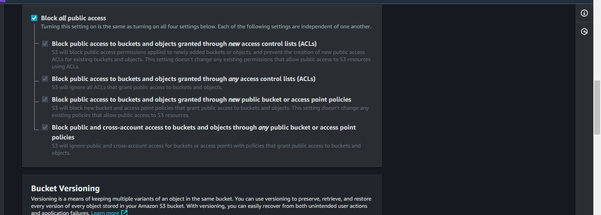
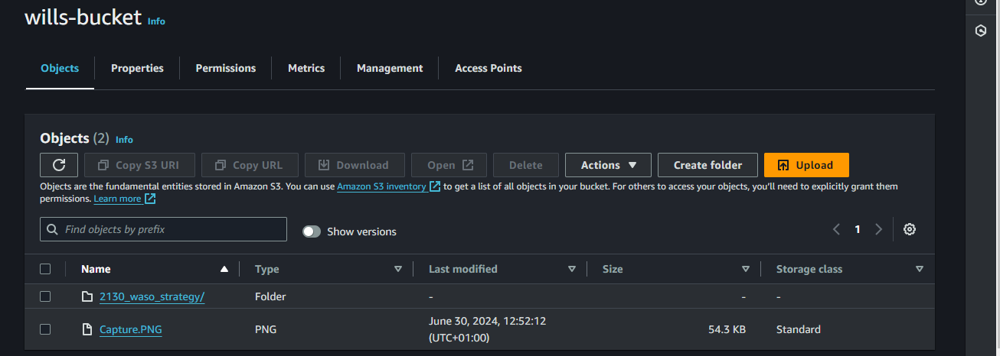
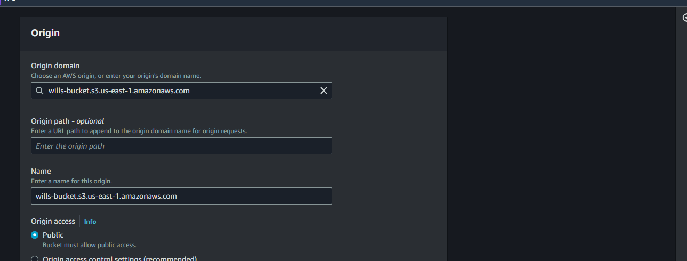
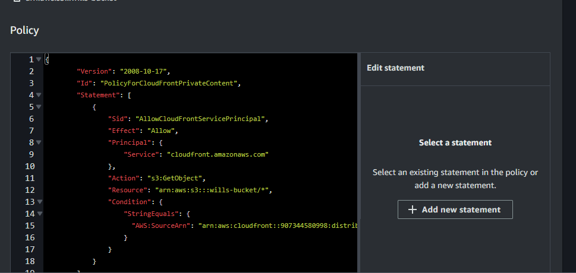

# S3 Bucket Policy For CLOUDFront Access
To secure your S3 bucket and ensure that it only allows access through your CloudFront distribution, you need to configure a bucket policy. This policy will restrict access based on the CloudFront distribution domain.

## Steps to Create an S3 Bucket
### 1. Open the S3 Console
- In the AWS Management Console, search for S3 in the services search bar and click on S3.
### 2 Create a New Bucket
- Click on the Create bucket button.
### Configure Bucket Settings
- Bucket Name: Enter a unique name for your bucket (e.g., my-unique-bucket-name). Bucket names must be globally unique.
- Region: Select the AWS Region where you want to create the bucket (e.g., US East (N. Virginia) us-east-1).
- Configure Options (Optional)
### Bucket settings for Block Public Access: 
- Choose the default settings to block public access or customize as per your requirements.
  
- Bucket Versioning: Enable if you want to keep multiple versions of an object in the same bucket.
- Tags: Add key-value pairs to help organize and manage your S3 resources.
- Object Lock: Enable if you want to store objects using a write-once-read-many.
#### Review and Create
-Review the settings you have configured.
- Click on the Create bucket button.
### Post-Creation Steps
Once the bucket is created, you can:

### Upload Files: 
- Click on the bucket name  
- Click Upload to add files to your bucket.
  
- Set Permissions: Configure permissions to control who can access the bucket and its objects.
- Enable Versioning: If not done during creation, you can enable versioning to keep multiple versions of objects.
- Configure Bucket Policies: Define policies to grant or deny permissions to users and services.
- Enable Logging: Enable server access logging to track requests for access to your bucket.

Sure! Below is a detailed guide in Markdown format on how to create a CloudFront distribution, choose the web distribution type, and configure settings to specify an S3 bucket as the origin.

# Creating a CloudFront Distribution with S3 as the Origin
Amazon CloudFront is a content delivery network (CDN) service that securely delivers data, videos, applications, and APIs to customers globally with low latency and high transfer speeds. This guide provides step-by-step instructions to create a CloudFront distribution, choose the web distribution type, and configure settings to specify an s3 bucket as the origin

### Creating a CloudFront Distribution
1. Sign in to AWS Management Console
- Navigate to the CloudFront Console.
2. Create a New Distribution
- Click on Create Distribution.
3. Select a Delivery Method
Under Select a delivery method for your content, choose Web and click Get Started.
### Configuring the Origin Settings
1. Specify the Origin Domain Name
In the Origin Settings section, for Origin Domain Name, enter the name of your S3 bucket or select it from the list.

Example: willsbucket.s3.amazonaws.com
### Configure Other Origin Settings
- Origin Path: Leave this field empty unless you want to serve content from a specific directory in your S3 bucket.
- Origin ID: A unique identifier for the origin. This can be automatically generated or customized.
- Restrict Bucket Access: Choose Yes if you want CloudFront to access the S3 bucket using an origin access identity (OAI).
If Yes, create a new OAI or select an existing one.
-Click on Update Bucket Policy to allow CloudFront to access your bucket.
### Additional Distribution Settings
1. Default Cache Behavior Settings
Viewer Protocol Policy: Choose between HTTP and HTTPS, Redirect HTTP to HTTPS, or HTTPS Only.
Allowed HTTP Methods: Select the HTTP methods you want to allow (e.g., GET, HEAD).
### 2. Cache Based on Selected Request Headers: 
- Choose None for simple caching or customize based on headers.
- Object Caching: Choose Use Origin Cache Headers or customize the TTL (Time to Live) settings.
- Forward Cookies: Choose how you want - CloudFront to handle cookies (e.g., None, Whitelist).
### 1. Distribution Settings
- Price Class: Select the price class that corresponds to the locations where you want CloudFront to distribute your content.
- Alternate Domain Names (CNAMEs): Enter any CNAMEs if you want to use your own domain.
- SSL Certificate: Choose Default CloudFront Certificate (cloudfront.net) or Custom SSL Certificate if you have your own.
- Default Root Object: Specify the default file to return when the viewer requests the root URL (e.g., index.html).
## Review and Create
1. Review Your Settings
- Verify all the configurations you have made.
2. Create Distribution
- Click on Create Distribution.
3. Wait for Deployment
It may take a few minutes for your distribution to deploy. You can check the status in the CloudFront console.

## Configure S3 Bucket Policy
1. Navigate to S3 Bucket Properties
- Open the AWS Management Console.
- Go to the S3 service.
- Select the bucket you want to configure.
### 2. Go to the Permissions Tab
- In the selected bucket, navigate to the Permissions tab.
 - Access the Bucket Policy Editor
Click on Bucket Policy.
- Configure the Bucket Policy
- Edit the policy to allow access only from your CloudFront distribution. 
You need to update the Resource and aws:Referer values with your actual bucket name and CloudFront distribution domain.
Example S3 Bucket Policy
Here's an example of an S3 bucket policy. 
Make sure to replace willsbucket with your S3 bucket name and YOUR_CLOUDFRONT_DOMAIN with your CloudFront distribution domain.

## Test Access Restrictions
Attempt Direct Access to S3 Object:

* Copy the S3 URL of an object stored in the bucket (e.g., http://mysecondcloudfronts3.s3-website-us-east-1.amazonaws.com).
* Paste the URL into a web browser and attempt to access the object directly.
- The access should be restricted, and you should receive an error or access denied message.
### Access Object Through CloudFront Distribution:

- Use the CloudFront distribution URL to access the same object.
- Using the CloudFront distribution domain (e.g., https://d2xaldklp25ip5.cloudfront.net).
- Paste the CloudFront distribution URL into a web browser and access the object.
- The object should be accessible, indicating that access is allowed through the CloudFront distribution.
- Verify Access Restrictions:

Compare the results of accessing the object directly from the S3 bucket URL and through the CloudFront distribution URL.
Confirm that direct access to the S3 URL is restricted while access through the CloudFront distribution URL is permitted.