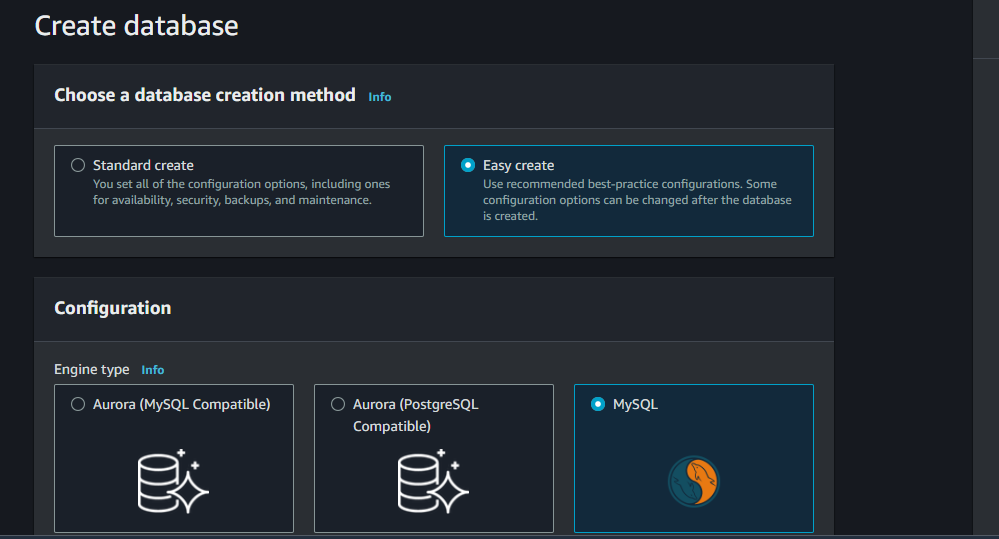
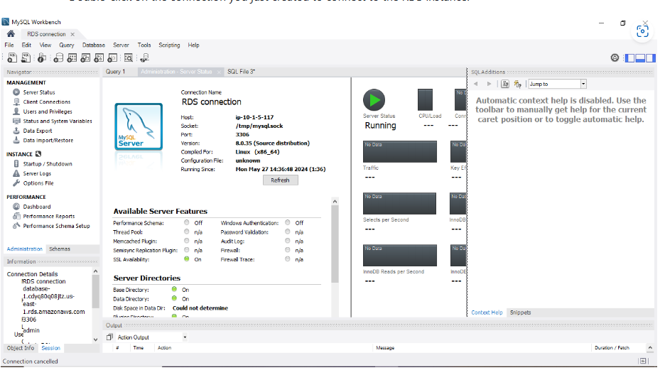

# Setting up Amazon RDS with MySQL Engine
## Task 1: Create RDS Instance
1 Log in to the AWS Management Console

- Open your web browser and navigate to the AWS Management Console.
- Enter your credentials (username and password) to log in.
### Navigate to the RDS Service

- Once logged in, find the search bar at the top of the console.
- Search for "RDS" and select "RDS" from the dropdown menu to navigate to the RDS service page.
  ### Create a Database

- On the RDS dashboard, click on the "Create database" button.
### Choose Easy create

I the data "base creation method", selet Easy Create

### Choose the MySQL Engine

- In the "Engine options" section, select the "MySQL" engine.
  ###  Configure the RDS Instance Settings

- DB Instance Identifier: Enter a unique identifier for your database instance.
- Master Username: Enter a master username for your database.
- Master Password: Enter a master password and confirm it by re-entering.
### Additional Configuration (optional)

- Customize additional settings such as instance type, storage, VPC, security groups, backup, and maintenance preferences as needed.
### Review and Create

- Review all the settings you have configured.
- Click on the "Create database" button to create your RDS instance.
Wait for Instance Creation

It may take a few minutes for AWS to create the RDS instance.
You can monitor the progress on the RDS dashboard.

## Task 2: Configure Security Group
- In the RDS Dashboard, Click on the Created RDS Instance

- Click on the identifier of the RDS instance you just created to view its details.
- In the 'Connectivity' Tab, Note the Security Group Associated with the RDS Instance

- Navigate to the 'Connectivity & security' tab of your RDS instance details page.
- Under the "Security" section, find and note the security group ID associated with your RDS instance.
- Navigate to the EC2 Service and Update the Inbound Rules of the Security Group to Allow MySQL Traffic

### Go to the EC2 dashboard.
- In the left-hand menu, click on "Security Groups" under the "Network & Security" section.
- Find the security group noted in the previous step and select it.
- Click on the "Inbound rules" tab and then click on the "Edit inbound rules" button.
- Add a new rule with the following details:
- Type: MySQL/Aurora
- Protocol: TCP
- Port Range: 3306
- Source: Custom (Enter the IP address range that you want to allow access, e.g., 0.0.0.0/0 for all IP addresses, though this is not recommended for production environments)
- Click on the "Save rules" button to apply the changes.
### Task 3: Connect to RDS Instance
- Use a MySQL Client (e.g., MySQL Workbench) to Connect to the RDS Instance

### Open MySQL Workbench:

- Launch MySQL Workbench on your computer.
- Create a New Connection:

- Click on the + icon next to "MySQL Connections" to create a new connection.
### Enter Connection Details:

### Connection Name: 
- Enter a name for your connection (e.g., "AWS RDS MySQL").

- Hostname:   Enter the endpoint of your RDS instance. You can find this on the "Connectivity & security" tab of your RDS instance details page under "Endpoint & port".

- Port: The default MySQL port is 3306. Ensure this matches the port of your RDS instance.

- Username: Enter the master username you specified when creating the RDS instance.

- Password: Click on the "Store in Vault..." button (or equivalent) to enter and save your password securely.
### Test the Connection:

- Click on the "Test Connection" button to ensure all details are correct and the connection can be established. If successful, you should see a "Successfully made the MySQL connection" message.
- Save and Connect:

- Click on "OK" to save the connection settings.
- Double-click on the connection you just created to connect to the RDS instance.

### Task 4: Create and Query Database
### Step-by-Step Instructions
- In the MySQL Client, Create a Sample Database

Once connected to your RDS instance using MySQL Workbench (or any other MySQL client), you can create a new database by executing the following SQL command:

### CREATE DATABASE sampledb;
### To execute this command:

- Open a new SQL tab in MySQL Workbench.
- Copy and paste the command into the query editor.
- Click the "Execute" button (or press Ctrl+Enter) to run the query.
- Verify the Database Creation

- To ensure that the database was created successfully, you can list all databases by executing:

  > SHOW DATABASES;

This will display a list of all databases, and sampledb should be included in the list.

### Task 4: Create and Query Database
### Step-by-Step Instructions
- In the MySQL Client, Create a Sample Database

- Once connected to your RDS instance using MySQL Workbench (or any other MySQL client), create a new database by executing the following SQL command:

   > CREATE DATABASE sampledb;

#### To execute this command:

- Open a new SQL tab in MySQL Workbench.
- Copy and paste the command into the query editor.
- Click the "Execute" button (or press Ctrl+Enter) to run the query.
- Verify the Database Creation

### To ensure that the database was created successfully, list all databases by executing:

> SHOW DATABASES;
- This will display a list of all databases, and sampledb should be included in the list.

- Use the Created Database

- Switch to the newly created database by executing the following command:

   > USE sampledb;

- This sets the context to sampledb so that subsequent operations are performed within this database.

### Create a Table

- Create a table named users within the sampledb database by executing the following SQL command:

> CREATE TABLE users (
    id INT PRIMARY KEY,
    name VARCHAR(255)
);

### To execute this command:

- Ensure you are still in the same SQL tab or open a new one if needed.
- Copy and paste the command into the query editor.
- Click the "Execute" button (or press Ctrl+Enter) to run the query.
- Verify the Table Creation

### To ensure that the table was created successfully, you can list all tables in the sampledb database by executing:

  > SHOW TABLES;

This will display a list of all tables, and users should be included in the list.

- Insert Data into the Table

- Insert some sample data into the users table by executing the following SQL command:

> INSERT INTO users (id, name) VALUES (1, 'John'), (2, 'Alice');

### To execute this command:

- Ensure you are in the same SQL tab or open a new one if needed.
- Copy and paste the command into the query editor.
- Click the "Execute" button (or press Ctrl+Enter) to run the query.
- Verify the Data Insertion

### To ensure that the data was inserted successfully, you can query the table by executing:

  > SELECT * FROM users;

This will display the data in the users table, and you should see the rows with id values 1 and 2 and corresponding name values 'John' and 'Alice'.