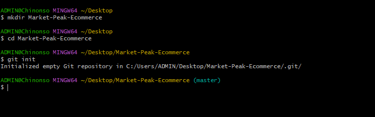
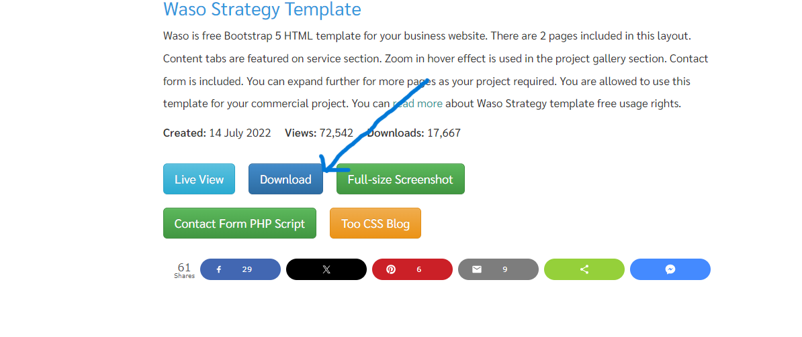

# Capstone Project-Introduction to Cloud Computing
## Capstone Project: E-Commerce Platform Deployment with Git, Linux, and AWS
#### Project Instructions:

In this project I will be developing an e-commerce website for a new online marketplace named "MarketPeak." This platform will feature product listings, a shopping cart, and user authentication.To implement this project I will use Git for version control, the develpoment platform will be in a Linux environment, and deploy it on an AWS EC2 instance. You can find a suitable website template here to kickstart your development

### Step 1: Development On Local Workstation
### Tasks 1: Implement Version Control with Git

### 1.1. Initialize Git Repository: Create the project directory or folder and name it "MarketPeak_Ecommerce". then cd into the new project directory and ini it as a git repository.

Note: In carrying out the this project, I have the option of using command line terminal of choice, but because I am using windows work station, I will be using "gitbash", this will allow me to run some shell commands on Windows.

```
mkdir MarketPeak_Ecommerce
cd MarketPeak_Ecommerce
git init
```


### Tasks 2: Get Source code from template.com:

### 2.1. Obtain and Prepare the E-Commerce Website Template:
 As a DevOps Engineer, I don't have to develope the website code, that work is for web/software developers. Instead of developing the website from scratch, I will use a pre- existing e-commerce website template.

#### 2.2 Download a Website Template:
 Visit (Tooplate)[https://www.tooplate.com/] or any other free template resource, and download a suitable e-commerce website template. Look for templates that are ready to use and require minimal adjustments. It is recommended you download the specific template
 
 ### 2.2 Prepare the Website Template:
  Extract the downloaded template into your project directory, MarketPeak_Ecommerce.
### Tasks 3: Stage and Commit the Template to Git:

Carrry out the following actions respectively

```
git config --global user.name "YourUsername"
git config --global user.email "youremail@example.com"
git commit -m "Initial commit with basic e-commerce site structure"
```

- Add your website files to the Git repository.

- commit your changes with a descriptive  massage eg"Downloaded template"
### Task 4: Push the code to your Github repository

All git activities done far were done for the repository to be trac by git on our local workstation.

What happen if our system is currupted by virus or our workstation totally breakdown, that means we will lost all of our files and start all over again. That is never the best practice. To avoid this we will carry out the following steps:

### 4.1 Create a Remote Repository on GitHub:
 Log into your GitHub account and create a new repository named "MarketPeak_Ecommerce" Leave the repository empty without initializing it with a README, .gitignore, or license.
### 4.2 Link Your Local Repository to GitHub: 
In your terminal, within your project directory, add the remote repository URL to your local repository configuration.


```
git remote add origin https://github.com/Nonsocha/MarketPeak_Ecommerce.git
```
### 4.3 Push your code to GitHub repository: 
Push using the following command:

`
git push -u origin main
`
## Step 2: AWS Deployment
### Task 1: Setup an AWS EC2 instance for deployment

#### Step 1 Log in to the AWS Management Console.
- Launch EC2 instance using Amazon Linux AMI
  
-   Connect to the instance using SSH Or HTTP
-  Click on the running ec2 instance,Navigate to ssh Client and copy the ssh client
  
- Change directory in the local machine to the directory where the pem key is located
  > cd Download
  
-Paste the it on the local machine to connect to the server
## Install git
If git is not installed in your server,install git

```
sudo yum update
sudo yum install git -y
```


### Task 2: Clone the repository on the Linux Server

Before deploying your e-commerce platform, you need to clone the GitHub repository to your AWS EC2 instance. This process involves authenticating with GitHub and choosing between two primary methods of cloning a repository: SSH and HTTPS.

### 2.1 Authenticating with GitHub using ssh

- For repositories that you plan to clone without setting up SSH keys, use the HTTPS URL. GitHub will prompt for your username and password:

Note that github.com no longer accept password, but you will have to generate token

```
git clone https://github.com/nbomasi/MarketPeak_Ecommerce.git
```
### Task 3: Installing a Web Server on EC2

Apache HTTP Server (httpd) is a widely used web server that serves HTML files and content over the internet. Installing it on Linux EC2 server allows you to host MarketPeak E-commerce site:

### 3.1 Install Apache web server on the EC2 instance:
 Note that httpd is the software name for Apache on redhats systems using yum package manager

I will use the following command to install Apache:
```
sudo yum update -y
sudo yum install httpd -y
sudo systemctl start httpd
```
### 3.2 Configure httpd for Website:

- Prepare the Web Directory: Clear the default httpd web directory and copy MarketPeak Ecommerce website files to it.
```
sudo cp -r ~/MarketPeak_Ecommerce/2130_waso_strategy/* /var/www/html/ # copy the content of MarketPeak_Ecommerce cloned earlier
```
### Reload httpd: 
Apply the changes by reloading the httpd service.

``sudo systemctl reload httpd``


### Task 4: Access Website from Browser
 With httpd configured and website files in place, MarketPeak Ecommerce platform is now live on the internet: Open a web browser and access the public IP (http://13.60.9.161/) of your EC2 instance to view the deployed website.

Note: that HTTP port 80 must be opened in AWS security group.
### Step3: Continuous Integration and Deployment Workflow
To ensure a smooth workflow for developing, testing, and deploying my e-commerce platform, follow this structured approach. It covers making changes in a development environment, utilizing version control with Git, and deploying updates to your production server on AWS.

### Task 1: Developing New Features and Fixes

1.1 Create a Development Branch:
 - Begin your development work by creating a separate branch. This isolates new features and bug fixes from the stable version of your website.
 - Create a new branch on the repository cloned to your local machine.
 

```
git branch development
git checkout development
```


### 1.2 Implement Changes:
 On the development branch, add your new features or bug fixes. This might include updating web pages, in my case, I just changed the slide image

### Task 2: Version control with Git

Run the following git command to stage, commit, and push to development branch:

```
git add .
git commit -m "Add new features or fix bugs"
git push origin development
```


Task 3: Pull Requests and Merging to the Main branch

### 3.1 Create a Pull Request (PR):
 On GitHub, create a pull request to merge the development branch into the main branch. This process is crucial for code review and maintaining code quality.


### 3.2 Review and Merge the PR:
 Review the changes for any potential issues. Once satisfied, merge the pull request into the main branch, incorporating the new features or fixes into the production codebase.
#### Move to the main branch and merge it with the development branch
```
git checkout main
git merge development
```
### 3.3 Push the Merged Changes to GitHub: 
Ensure that your local main branch, now containing the updates, is pushed to the remote repository on GitHub.
```
git pull
git push origin main
```

### Task 4: Deploying Updates to the Production Server

### Navigate to the website's directory and pull the latest changes from the main branch.
``git pull origin main``


4.2 Restart the Web Server (if necessary): Depending on the nature of the updates, you may need to restart the web server to apply the changes.

``
sudo cp -r ~/Darey,io/2130_waso_strategy/* /var/www/html/
``

``sudo systemctl reload httpd``

Task 5: Testing the New Changes

5.1 Access the Website: Open a web browser and navigate to the public IP address of your EC2 instance. Test the new features or fixes to ensure they work as expected in the live environment.

This workflow emphasizes best practices in software development and deployment, including branch management, code review through pull requests, and continuous integration/deployment strategies. By following these steps, you maintain a stable and up-to-date production environment for your e-commerce platform.

http://13.60.9.161/2130_waso_strategy