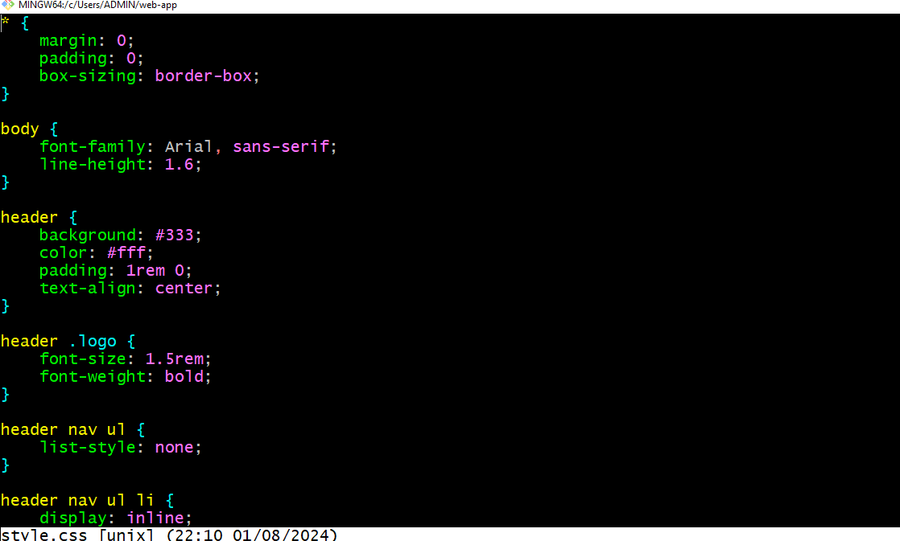

# Basic Frontend Application with Docker and Kubernetes
## Use Case: 
 i would containerize a simple static website using Docker, deploy it to a Kubernetes cluster, and access it through NGINX. Here's a step-by-step guide to help you achieve this:

 ### Task 1: Set up The Project
 - Create a new directory

   

- inside the directory create an Html file and Css file
  
  #### index.html
  

  #### style.css
    

### Task 2: Initialize a git repository
  - To initialize git in a repository use the command below:
     
     `git init`
### Task 3:
 Add and commit the code to the repository.
        
### Task 4 : Dockerize The Application
### Create a dockerfile specifying Nginx as the base image

- Create a file called dockerfile

- Open a vim editor
- write the  nginx script for dockerfile.
- Copy the directory Demo to the Nginx Html directory  
  
- Save file with "esc :wq" press enter button.
-  Create an index.html and style.css file in a called Demo.
  
  

### Task 5: Push To Docker Hub
- log into your docker hub account with the command below
  `docker login -u sirwills`
  Replace  `sirwills` with your docker hub username
- Tag the docker image using the command
  ```
  docker tag <your-image-name> <your-dockerhub-username>/<your-repository-name>:<tag>docker push <your-dockerhub-username>/<your-repository-name>:<tag>

  ```

  
  - Push the image to docker hub
  ```
    docker push <your-dockerhub-username>/<your-repository-name>:<tag>
  ```

- Verify the image
  

## 6 Set up a Kubenetes Cluster
To install Kubernetes in Docker using the tool known as kind (Kubernetes IN Docker), you can follow these detailed steps.
# 1 Installing Kubernetes in Docker using kind

## Prerequisites

Before you begin, ensure you have the following installed on your system:

1. **Docker**: Install Docker from the official [Docker website](https://www.docker.com/get-started).
2. **kubectl**: Install kubectl by following the instructions on the [Kubernetes website](https://kubernetes.io/docs/tasks/tools/install-kubectl/).

## Steps

## 1. Install kind

#### For macOS and Linux

You can install kind using `curl`:

```sh
curl -Lo ./kind https://kind.sigs.k8s.io/dl/latest/kind-$(uname)-amd64
chmod +x ./kind
mv ./kind /usr/local/bin/kind
```
### For Windows

### Install Go on Windows.
### 1 Download the Go installer:
- Go to the official Go download page.
- Download the Windows installer (.msi file) for the latest version of Go.
### Run the installer:

- Double-click the downloaded .msi file to run the installer.
- Follow the instructions in the installer to complete the installation.
- Verify the installation:

- Open a new Git Bash terminal.

Verify that Go is installed correctly by running the following command:


`go version`

### Adding Go to the PATH
- The Go installer typically adds Go to the system PATH automatically. If for some reason this doesn’t happen, you can add it manually:

### 1 Find the Go installation path:

- The default installation path is C:\Go.
### 2 Add the Go binary path to the system PATH:

- Right-click on "This PC" or "Computer" on your desktop or in File Explorer and select "Properties".
- Click on "Advanced system settings" and then on the "Environment Variables" button.
- In the "System variables" section, find the "Path" variable and select it.
-  Click on "Edit".
- Add C:\Go\bin to the list and click "OK" on all windows to apply the changes.
### 3 Verify the PATH update:

- Open a new Git Bash terminal.

- Run the following command to ensure go is in your PATH:

    `go version`

  

## Install kind with Go  
If you have Go installed, you can install kind using the following this steps after installing Go:
### 1 install kind
- Open Git Bash.

- Run the following command to install kind:

   `
   go install sigs.k8s.io/kind@v0.20.0
   `

## 2 Verify the kind installation:

- Ensure that the Go binary directory ($GOPATH/bin or ~/go/bin by default) is in your PATH.

- Check the installation by running:

  `kind --version
  `
### 3 Create a Kubernetes cluster:

Run the following command to create a Kubernetes cluster:

  `
  kind create cluster
  `

  

### Task 7: Deploye to Kubenetes

#### Create a Kubenetes YAML File Specifying  as ClusterIP
To create a Kubernetes Service of type ClusterIP, you need to create a YAML configuration file and then apply it to your cluster using kubectl. Below are the steps and an example of how to achieve this:
### Step-by-Step Guide
- Create a YAML File for the Depolyment:

Create a file named deployment.yaml with the following content. This example assumes you are exposing a deployment named nginx-deployment on port 80.


#### 2 Apply the Service to Your Cluster:

Use kubectl to apply the configuration file and create the deployment.


```
kubectl apply -f deployment.yaml
```

### 3 Verify the deployment Creation:

Check if the service is created successfully.
```
kubectl get deployments
```

### Task 8 Create a Service (ClusterIP)
Create a YAML File for the Services:

Create a file named services.yaml with the following content. This example assumes you are exposing a deployment named nginx-deployment on port 80.


 2 Apply the Service to Your Cluster:

Use kubectl to apply the configuration file and create the service.
```
kubectl apply -f service.yaml
```

### 3 Verify the deployment Creation:

Check if the service is created successfully.
```
kubectl get services
```


## Task 9: Access the Application
To access your application locally by port-forwarding to the service, follow these steps:

1. Identify the Service:
   - First, identify the name of the service you want to port-forward to. You can list all services to find the correct one:

      ``kubectl get services``

2. Port-Forward to the Service:
   - Use the kubectl port-forward command to forward a local port to the service's port. For example, if your service is named my-demo-service and it exposes port 80, you can forward it to a local port, like 8080:

     ```kubectl port-forward service/my-nginx-service 3000:80 ```

     

    This command forwards port 8080 on your local machine to port 80 on the my-nginx-service.

3. Open Your Browser:
- Open your web browser and visit the following URL:

  `http://127.0.0.1:3000`

  This should allow you to view your simple frontend application.
     

If you encounter any issues, make sure your service is running and correctly configured. Additionally, ensure no other process is using the local port you are trying to forward to.


