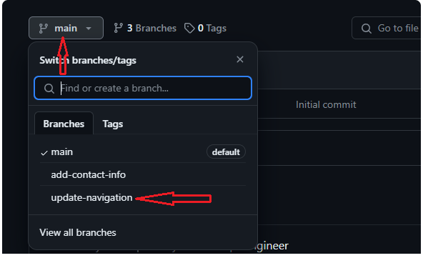
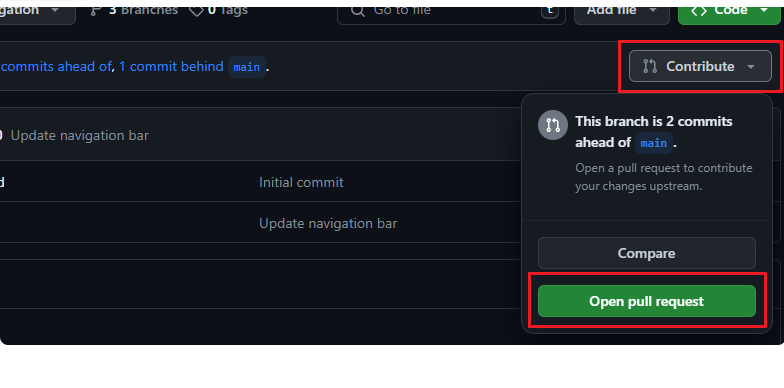
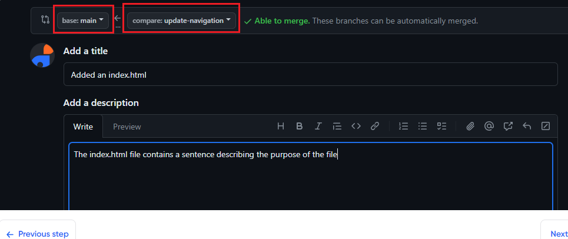

# Git Branching and Merging

#### Merg Changes
* After peter and paul has push their changes to their respective github,and team can review or merge this changes to the main project.The process invovles:
### 1 Creating a git pull
### 2 Merging the pull request into the main branch.
## How to create  a pull Request in Github
After the work has been pushed to github the next step is to create a pull request for each of them.Below are the step:
### 1 Navigate to The Github Repository
  - Open the web browser
### 2 Switch to the Branch :
Click the branch dropdown menu near the top left corner of the file list and slect the branch.

### 3 Create a New  Pull Request
  - Click the "The new pull request" next to the branch dropdown menu
  
  - Github automatically takes you to a new page to initial a pull request.It automatically select main project branch as the base and the recently pushed branch as the compare branch
  ### 4 Review the changes:
  - Before creating pull request review the changes to ensure everything is correct.
### 5 Create a Pull Request
- if anything looks good,Click the  ###  "Create pull request"button
- Provide a title and description for the pull request
- After filling the information, Click on "Create pull Request" 
   
### Review and Merge Pull Request
Once the pull request is created it becomes visible to the team,who can review changes,leave a comment.After the review the pull request can be merged incoperating the changes from the "update-navigation"branch into the main branch
  ### Updating Latest Changes 
  Before merging the changes it is important to ensure that the branch is up-to-date with the main branch.
  #### Steps to Update the Branch
- On the terminal switch to the branch
   > git checkout branch-name 
- Pull the latest Changes from the main branch
  >git pull origin main
- Merge the pull request to the main branch: Click on the " Merge pull Request" to merge the changes into the main branch
- Push the updated branch to github
    >git push origin branch-name
- Create a pull request
- Merge the pull request      
