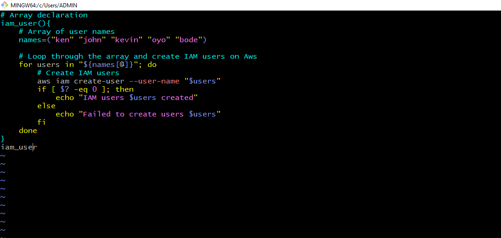
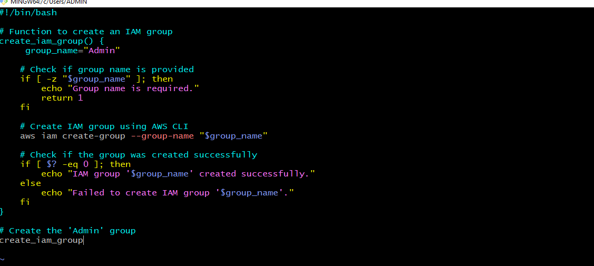

# SHELL SCRIPTING FOR AWS MANAGEMENT
# Capstone Project: Shell Script for AWS IAM Management
In this project  Datawise Solution requires  efficient management  of AWS identity and Access  Management (IAM) resources.The company is expanding its team and needs to onboard new five to access AWS resources securely.

- Below is the script we are to Enhance and include IAM resources 
```
#!/bin/bash

# Environment variables
ENVIRONMENT=$1

check_num_of_args() {
# Checking the number of arguments
if [ "$#" -ne 0 ]; then
    echo "Usage: $0 <environment>"
    exit 1
fi
}

activate_infra_environment() {
# Acting based on the argument value
if [ "$ENVIRONMENT" == "local" ]; then
  echo "Running script for Local Environment..."
elif [ "$ENVIRONMENT" == "testing" ]; then
  echo "Running script for Testing Environment..."
elif [ "$ENVIRONMENT" == "production" ]; then
  echo "Running script for Production Environment..."
else
  echo "Invalid environment specified. Please use 'local', 'testing', or 'production'."
  exit 2
fi
}

# Function to check if AWS CLI is installed
check_aws_cli() {
    if ! command -v aws &> /dev/null; then
        echo "AWS CLI is not installed. Please install it before proceeding."
        return 1
    fi
}

# Function to check if AWS profile is set
check_aws_profile() {
    if [ -z "$AWS_PROFILE" ]; then
        echo "AWS profile environment variable is not set."
        return 1
    fi
}

# Function to create EC2 instances
create_ec2_instances() {

    # Specify the parameters for the EC2 instances
    instance_type="t2.micro"
    ami_id="ami-0649bea3443ede307"
    count=2  # Number of instances to create
    region="us-east-2"  # Region to create cloud resources
    subnet_id="subnet-04c5dcc7a1bc79b2c"
    key_pair="Ohio"

    # Create the EC2 instances
    response=$(aws ec2 run-instances \
        --image-id "$ami_id" \
        --instance-type "$instance_type" \
        --count "$count" \
        --associate-public-ip-address \
        --key-name "$key_pair" \
        --subnet-id "$subnet_id" \
        --region "$region")

    # Check if the EC2 instances were created successfully
    if [ $? -eq 0 ]; then
        echo "EC2 instances created successfully."
        # Extract and log instance IDs
        instance_ids=$(echo $response | jq -r '.Instances[].InstanceId')
        echo "Instance IDs: $instance_ids"
    else
        echo "Failed to create EC2 instances."
    fi
}
# Function to create S3 buckets for different departments
create_s3_buckets() {
    # Define a company name as prefix
    company="fashion"
    region="us-east-2"
    # Array of department names
    departments=("marketing" "sales" "hr" "operations" "media")

    # Loop through the array and create S3 buckets for each department
    for department in "${departments[@]}"; do
        bucket_name="${company}-${department}-data-bucket"
        # Create S3 bucket using AWS CLI
        aws s3api create-bucket --bucket "$bucket_name" --region "$region" --create-bucket-configuration LocationConstraint="$region"
        if [ $? -eq 0 ]; then
            echo "S3 bucket '$bucket_name' created successfully."
        else
            echo "Failed to create S3 bucket '$bucket_name'."
        fi
    done
}


check_num_of_args
activate_infra_environment
check_aws_cli
check_aws_profile
create_ec2_instances
create_s3_buckets
```

### Define IAM User Names Array:

- Store the names of the five IAM users in an array for easy iteration during user creation
  
  ```
  # Array declaration
IAM_USERS=("user1" "user2" "user3" "user4" "user5")

# Print all elements of the array
echo "IAM Users:"
for user in "${IAM_USERS[@]}"; do
    echo "$user"
done
``
### Create IAM Users:

- Iterate through the IAM user names array and create IAM users for each employee using AWS CLI commands.
```
# Array declaration
create_iam_users(){
    # Array of users names
    names=("ken" "john" "kevin" "oyo" "bode")

    # Loop through the array and create IAM users on Aws
    for users in "${names[@]}"; do
        # Create IAM users
        aws iam create-user --user-name "$users"
        if [ $? -eq 0 ]; then
            echo "IAM users $users created"
        else
            echo "Failed to create users $users"
        fi
    done
}
create_iam_users
```



### Create IAM Group:

- Define a function to create an IAM group named "admin" using the AWS CLI.
  
```
#!/bin/bash

# Function to create an IAM group
create_iam_group() {
     group_name="Admin"

    # Check if group name is provided
    if [ -z "$group_name" ]; then
        echo "Group name is required."
        return 1
    fi

    # Create IAM group using AWS CLI
    aws iam create-group --group-name "$group_name"

    # Check if the group was created successfully
    if [ $? -eq 0 ]; then
        echo "IAM group '$group_name' created successfully."
    else
        echo "Failed to create IAM group '$group_name'."
    fi
}
#Call the 'Admin' group
create_iam_group

```


### Attach Administrative Policy to Group:

Attach an AWS-managed administrative policy (e.g., "AdministratorAccess") to the "admin" group to grant administrative privileges.

```
    # Attach policy to IAM group using AWS CLI
   
    attach_admin_policy_to_group(){
   
    aws iam attach-group-policy --group-name 
    
    "$group_name" --policy-arn "$policy_arn"
    
    # Check if the policy was attached 
    successfully
    
    if [ $? -eq 0 ]; then
    
        echo "Policy '$policy_arn' attached to 
        
        group '$group_name' successfully."
    
    else
    
        echo "Failed to attach policy 
        
        '$policy_arn' to group '$group_name'."
    fi
}
```


## Project Deliverables:
###  Comprehensive Documentation
Thought Process in Developing the Enhanced Script
## Objective:
### Enhance a Bash script to include various AWS management functionalities, specifically to:

1 Manage IAM users and groups.
2 Deploy Apache on EC2 instances.
3 Create S3 buckets for different departments.
### Initial Analysis:
- The original script handled different environments and performed basic setup checks. - The enhancement aimed to add several AWS management tasks while retaining the existing functionalities.
- Enhancement Steps and Thought Process:

### 1 Add Environment Argument Validation:

- Ensure that the script takes exactly one argument for the environment.
- If the number of arguments is not correct, the script provides usage instructions and exits.
```
check_num_of_args() {
    if [ "$#" -ne 1 ]; then
        echo "Usage: $0 <environment>"
        exit 1
    fi
}
```
### 2 Activate Environment:

- The script acts based on the provided environment value (local, testing, production).
- It prints a message corresponding to the selected environment
  
```
activate_infra_environment() {
    if [ "$ENVIRONMENT" == "local" ]; then
        echo "Running script for Local Environment..."
    elif [ "$ENVIRONMENT" == "testing" ]; then
        echo "Running script for Testing Environment..."
    elif [ "$ENVIRONMENT" == "production" ]; then
        echo "Running script for Production Environment..."
    else
        echo "Invalid environment specified. Please use 'local', 'testing', or 'production'."
        exit 2
    fi
}
```
### 3 Check AWS CLI and Profile:

- Ensure AWS CLI is installed on the system.
- Check if the AWS profile environment variable is set.

```
check_aws_cli() {
    if ! command -v aws &> /dev/null; then
        echo "AWS CLI is not installed. Please install it before proceeding."
        exit 1
    fi
}

check_aws_profile() {
    if [ -z "$AWS_PROFILE" ]; then
        echo "AWS profile environment variable is not set."
        exit 1
    fi
}
```
### 4 Define IAM Users Array:

- An array names is created to store the IAM user names.
- A function iam_user iterates through the array and creates IAM users using the AWS CLI.
```
iam_user() {
    names=("ken" "john" "kevin" "oyo" "bode")
    for users in "${names[@]}"; do
        aws iam create-user --user-name "$users"
        if [ $? -eq 0 ]; then
            echo "IAM user $users created"
        else
            echo "Failed to create user $users"
        fi
    done
}Create IAM Group and Attach Policy:
```

### 5 Functions create_iam_group and attach_policy_to_group handle the creation of an IAM group and attaching a policy to it.
```
create_iam_group() {
    group_name="Admin"
    aws iam create-group --group-name "$group_name"
    if [ $? -eq 0 ]; then
        echo "IAM group '$group_name' created successfully."
    else
        echo "Failed to create IAM group '$group_name'."
    fi
}

attach_policy_to_group() {
    group_name="Admin"
    policy_arn="arn:aws:iam::aws:policy/AdministratorAccess"
    aws iam attach-group-policy --group-name "$group_name" --policy-arn "$policy_arn"
    if [ $? -eq 0 ]; then
        echo "Policy '$policy_arn' attached to group '$group_name' successfully."
    else
        echo "Failed to attach policy '$policy_arn' to group '$group_name'."
    fi
}
```
### 6 Deploy Apache on EC2 Instances:

The deploy_apache function launches EC2 instances, installs Apache, and deploys files to the web server.
```
deploy_apache() {
    instance_type="t2.micro"
    ami_id="ami-0649bea3443ede307"
    count=1
    region="us-east-2"
    subnet_id="subnet-0592ac84b15734705"
    key_pair="Ohio"
    app_files="/c/Users/ADMIN/Desktop/2130_waso_strategy"
    private_key_path="/c/Users/ADMIN/Downloads/Ohio.pem"
    instance_ids=$(aws ec2 run-instances \
        --image-id "$ami_id" \
        --instance-type "$instance_type" \
        --count "$count" \
        --associate-public-ip-address \
        --key-name "$key_pair" \
        --subnet-id "$subnet_id" \
        --region "$region" \
        --user-data '#!/bin/bash
        yum update -y
        yum install -y httpd
        mkdir -p /var/www/html/
        chown ec2-user:ec2-user /var/www/html/
        systemctl start httpd
        systemctl enable httpd' \
        --tag-specifications 'ResourceType=instance,Tags=[{Key=Name,Value=ApacheServer}]' \
        --query 'Instances[*].InstanceId' \
        --output text)
    if [ $? -eq 0 ]; then
        echo "EC2 instances launched successfully with Instance IDs: $instance_ids"
    else
        echo "Failed to launch EC2 instances."
        return 1
    fi
    echo "Waiting for the instances to be in a 'running' state..."
    aws ec2 wait instance-running --instance-ids $instance_ids
    sleep 30
    for instance_id in $instance_ids; do
        public_dns=$(aws ec2 describe-instances \
            --instance-ids $instance_id \
            --query 'Reservations[*].Instances[*].PublicDnsName' \
            --output text)
        if [ -z "$public_dns" ]; then
            echo "Failed to retrieve public DNS for instance $instance_id, trying public IP address instead..."
            public_ip=$(aws ec2 describe-instances \
                --instance-ids $instance_id \
                --query 'Reservations[*].Instances[*].PublicIpAddress' \
                --output text)
            if [ -z "$public_ip" ]; then
                echo "Failed to retrieve public IP address for instance $instance_id"
                continue
            else
                public_dns=$public_ip
            fi
        fi
        echo "Deploying files to instance $instance_id with DNS $public_dns"
        scp -i "$private_key_path" -r "$app_files" ec2-user@"$public_dns":/var/www/html/
        if [ $? -eq 0 ]; then
            echo "Files deployed successfully to instance $instance_id ($public_dns)"
        else
            echo "Failed to deploy files to instance $instance_id ($public_dns)"
        fi
    done
}
```
### 7 Create S3 Buckets for Different Departments:

- The create_s3_buckets function creates S3 buckets for different departments using the AWS CLI.
```
  create_s3_buckets() {
    company="fashion"
    region="us-east-2"
    departments=("marketing" "sales" "hr" "operations" "media")
    for department in "${departments[@]}"; do
        bucket_name="${company}-${department}-data-bucket"
        aws s3api create-bucket --bucket "$bucket_name" --region "$region" --create-bucket-configuration LocationConstraint="$region"
        if [ $? -eq 0 ]; then
            echo "S3 bucket '$bucket_name' created successfully."
        else
            echo "Failed to create S3 bucket '$bucket_name'."
        fi
    done
}
```
### 8 Integrate Functions and Main Script Execution:

- Ensure all functions are called in the correct order in the main script execution flow
```
  #Function for arguments
check_num_of_args "$@"

activate_infra_environment

check_aws_cli

check_aws_profile

#Call the function to create users
iam_user

#Create the 'Admin' group
create_iam_group

#Call function to attach policy
attach_policy_to_group

#Call Function to deploy Apache on an EC2 instance
deploy_apache

#Call the function to create S3 buckets for different departments
create_s3_bucketsThis 
```

- Comprehensive documentation details the thought process and steps taken to develop the enhanced script, ensuring clarity and understanding of the modifications and their purpose.


