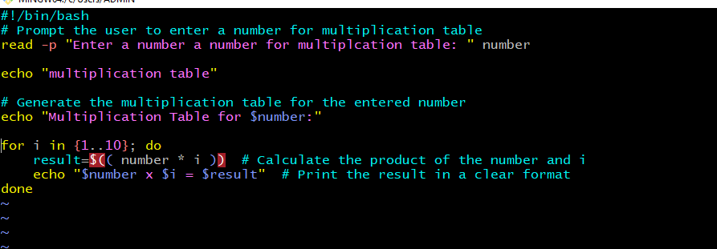
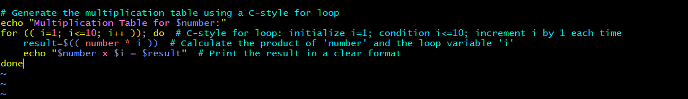
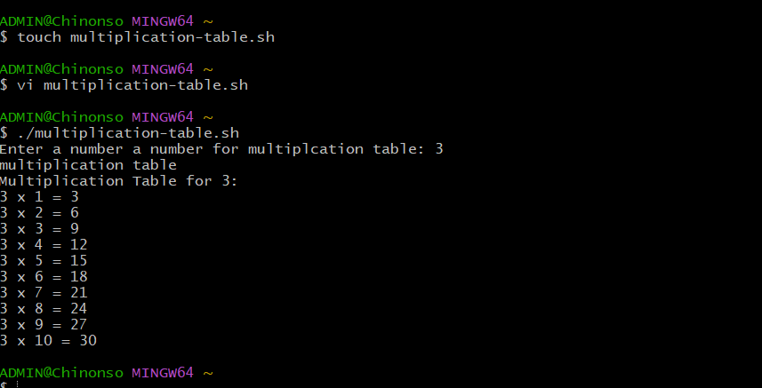
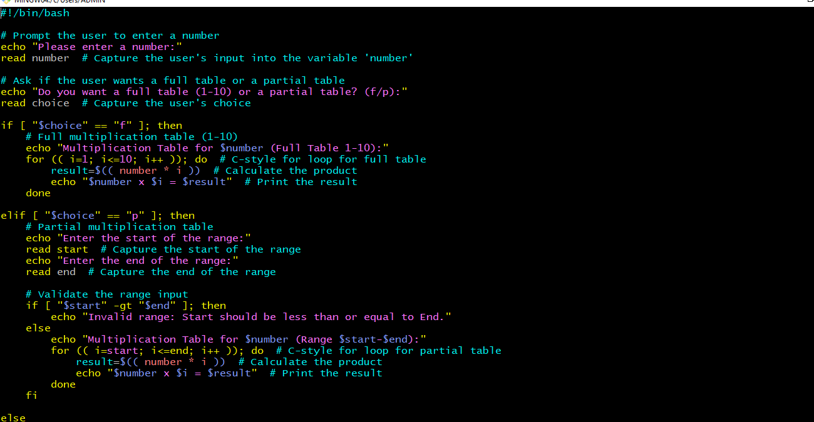
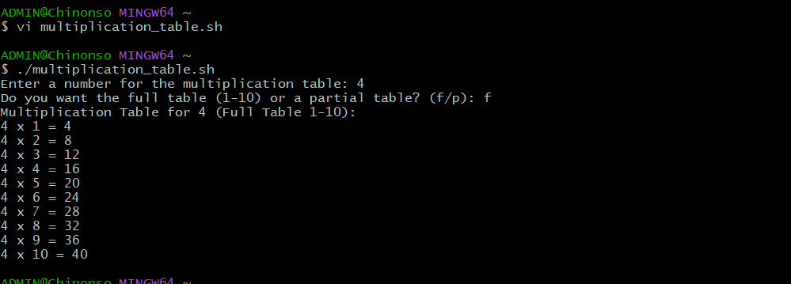

## Bash script for Generating a Multiplication Table
###  User input for number:
The script must first ask the user to input a number for which the multiplication table is to be generated

### Choice of Table Range:
ask the user if they want a full multiplication table (1 to 10) or a partial table. If they choose partial, prompt them for the start and end of the range

### Use of Loops:
Implement the logic to generate the multiplication table using loops. You may use either the list form or C-style for loop based on what's appropriate

### Conditional Logic:
Use if-else statements to handle the logic based on the user's choices (full vs. partial table and valid range input).

### Input Validation:
Ensure that the user enters valid numbers for the multiplication table and the specified range Provide feedback for invalid inputs and default to a full table if the range is incorrect

### Working:
I start the script by prompting the user to enter a number for the multiplication table:

``read -p "Enter a number to generate its multiplication table: " number``

I then use ``echo "multiplication Table for $number"`` to print the header for the multiplication table.

### Writing the following line to generate the function generate_full_table() :
List form of for loop: This loop iterates through the values of i from 1 to 10. For each i, it calculates the result of number * i and prints the equation.

### Explanation:
### 1 Prompt the User:

- echo "Please enter a number:" displays a message asking the user to input a number.
- read number captures the user's input and stores it in the variable number.
### 2 Loop to Generate the Multiplication Table:

- for i in {1..10}; do starts a loop that runs from 1 to 10.
- result=$(( number * i )) calculates the multiplication of the user's number by the current loop number (i).
- echo "$number x $i = $result" prints the multiplication in a clear format, e.g., "3 x 1 = 3".

C-style form of for loop: This loop initializes i to 1, runs the loop until i reaches 10, and increments i by 1 in each iteration. It calculates the result of number * i and prints the equation.

### Output:

### Writing the following line to generate a full or partial multiplication table:

### Explanation:
### 1 Prompt for Full or Partial Table:

- The script asks the user whether they want a full table (f) or a partial table (p).
### Full Table:

- If the user chooses f, the script generates a multiplication table from 1 to 10 using a C-style for loop.
### Partial Table:

- If the user chooses p, the script asks for the start and end of the range, then generates the multiplication table for that range using a C-style for loop.
- The script also checks if the start is greater than the end to prevent an invalid range.
- c-style On the C-style for loop, iterating through the numbers from start to limit, calculating the multiplication results, and displaying them.

### Handling Invalid Input:

- If the user enters an invalid choice (neither f nor p), the script displays an error message.

### Explanation:

### 1 User Input for Number:
The script begins by asking the user to input a number, which will be used to generate the multiplication table.

### 2 Choice of Table Range:
The script then asks whether the user wants a full table (from 1 to 10) or a partial table.
If the user selects f, the script generates a multiplication table from 1 to 10.
If the user selects p, the script asks for a custom range, prompting for the start and end values. It then validates the input to ensure the start value is not greater than the end value.

### 3 Use of Loops:
The multiplication table is generated using a C-style for loop, iterating over the specified range.

### 4 Error Handling:
The script includes basic error handling for invalid user inputs, such as entering a start value greater than the end value or an invalid choice between full or partial tables.
Output:
For partial Output with a custom range:

For a full table
